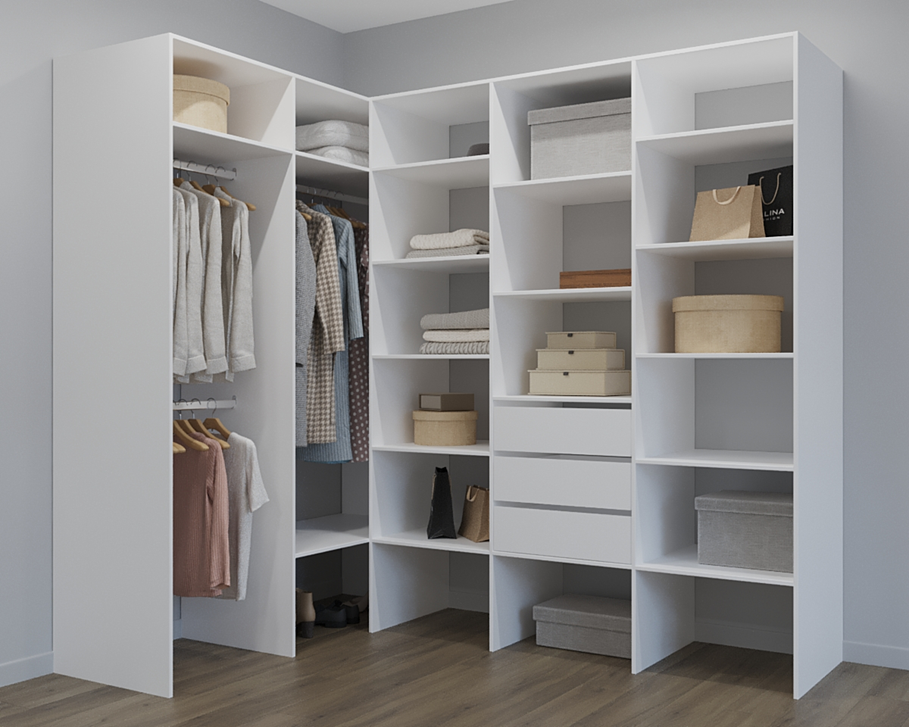

Специалисты по дизайну интерьера утверждают, что наличие шкафа является душой и украшением каждого дома, с его помощью есть возможность задать стиль и основное настроение комнаты. Именно поэтому каждый покупатель ответственно и тщательно подходит к [выбору шкафа-купе](/catalog), который создаст правильную атмосферу в доме.

**Основные преимущества шкафа-купе:**

- широкие дизайнерские проявления по улучшению готового шкафа;
- привлекательный вид;
- надежность конструкции;
- высокий комфорт в применении этого мебельного изделия.

Жители небольших квартир в основном склоняются к покупке вмонтированных шкафов. Однако нужно помнить, что это весьма тяжелая конструкция, которую способна выдержать не каждая стена.

Правильный выбор шкафа-купе заключается еще и в том, чтобы точно подобрать глубину. Самым оптимальным вариантом является 60 см. Необходимо задумываться о будущем, так как вещей с каждым годом добавляется все больше, и их нужно где-то хранить. Именно поэтому глубина такого шкафа позволит на долгое время забыть о том, что нет места для одежды.

Модель шкафа в первую очередь зависит от места его расположения. Будь он расположен в детской комнате, гостиной или же спальне, он всегда будет наделен индивидуальными особенностями, которые проявляются в дизайне конструкции.

## Материалы, из которых изготавливаются шкафы-купе

- **МДФ** – материал, отличающийся особенной прочностью и надежностью.
- **ДСП** – наиболее распространенный материал, который применяют в процессе изготовление шкафов-купе. Самый дешевый вариант, в результате которого цена на готовый шкаф значительно снижена, что очень привлекает многих покупателей.
- **ДВП** – материал, который применяется в виде полок в шкафу, он непрочный и способен впитывать влагу.

Именно поэтому, при покупке шкафа-купе необходимо уточнять, из какого материала он изготовлен, чтобы в будущем избежать плохих последствий.

Большой популярностью отмечаются зеркальные двери в шкафе-купе, которые смотря эстетично, очень привлекательно и дарят невероятный комфорт. Хотя большинство покупателей отказываются приобретать шкафы с такими зеркалами, так как думают, что они опасны в процессе использования. Однако это вовсе не так, ведь в процессе производства таких зеркал на двери накладывается специальная защитная пленка, которая в случае удара удерживает осколки. Поэтому не стоит опасаться таких зеркал, а смело покупать, чтобы особенно красиво преобразить свою комнату.

[Перейти к выбору шкафа-купе](/catalog)
