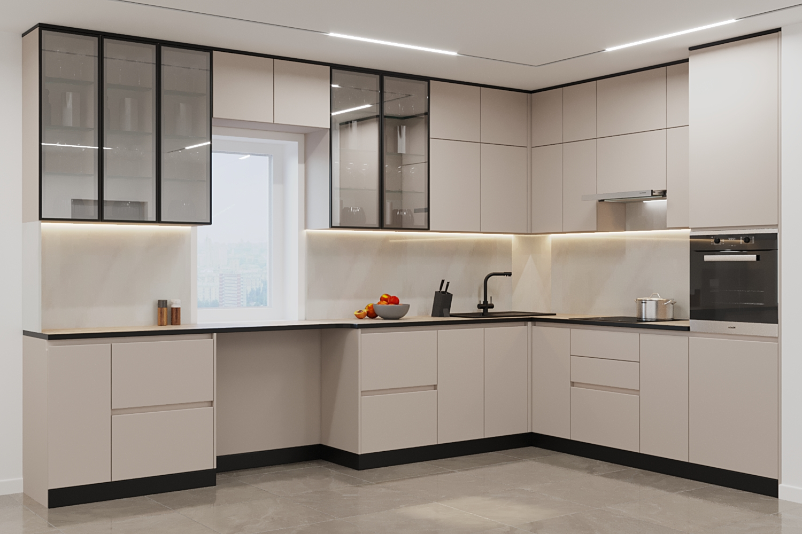

Для современного человека [кухня](/rosmebeli/catalog) занимает особое место, и оно предназначено не просто для приготовления пищи. Это место, где всегда можно собраться за чашечкой чая или кофе и мило побеседовать.

На сегодня фантазия выбора и установки кухонь весьма свободна, поэтому каждая хозяйка отталкивается от финансового положения семьи и стилевых предпочтений.

Перед покупкой кухонной мебели, обязательно необходимо сразу определиться, для каких намерений она нужна. Если же вы собираетесь проводить там мало времени, и совсем не любите готовить, то для такой цели будет уместным минимализм, где мало шкафов и тумб, которые предназначены для самого необходимого. В том случае, если семья большая и приходится подолгу быть на кухне, то необходима максимально вместительная и функциональная мебель с большим количеством бытовых предметов, которые станут неотъемлемыми помощниками для хозяйки.

**Весьма важно, чтобы кухонная мебель была:**

- функциональной;
- достаточно вместительной;
- простой в обслуживании, а также использовании;
- выдерживала низкие и высокие температуры, и частые перепады температур;
- чтобы была устойчива к действию агрессивной среды и другим бытовым предметам;
- долговечна;
- гармонично вписывалась по дизайну со всеми остальными принадлежностями.

Прежде чем приступить к выбору кухонной мебели, необходимо сделать качественный ремонт и определиться с цветовым решением, ведь все должно быть сделано со вкусом и подходить по цвету.

## Стили кухни

В моде всегда остается классический стиль, где мебель сделана из натурального и дорогого дерева. Однако не каждый способен позволить себе такую роскошь.

Одним из наиболее распространенных стилей является модерн, который основывается на удобстве. Все дополнительные кухонные детали здесь правильно расположены, отсутствуют лишние мелочи.

Кантри также считается популярным стилем, так как здесь присуща натуральность. Это: цветы, плетения мебели и пучок зеленого лука.

На сегодняшний день, существует большой выбор кухонной мебели. Она может быть разной формы, материала, иметь разные стилевые решения. Какой вариант выбрать, каждый решает сам для себя, в основном это зависит от финансового расположения покупателя, его вкуса и размера кухонного помещения.

Старайтесь приобретать мебель у проверенной фирмы, благодаря чему будет минимальный риск приобрести подделку, чем в случае покупки в маленьком магазине или на рынке.

[Перейти к выбору кухни](/rosmebeli/catalog)
